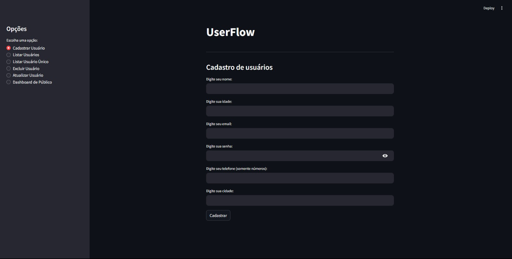
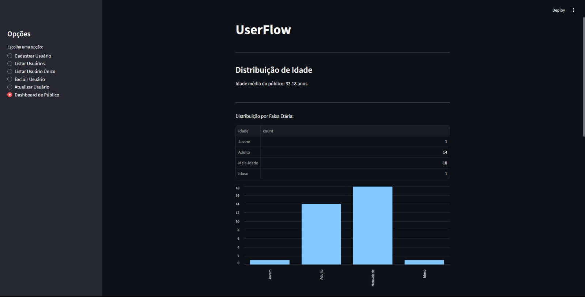
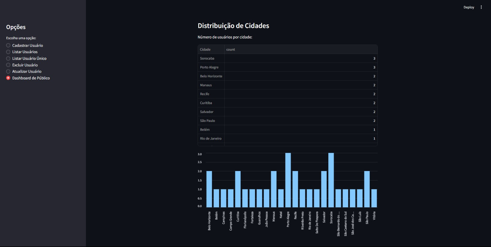

# UserFlow

## 📌 Sobre o Projeto

**UserFlow** é um sistema eficiente para cadastro, listagem, atualização e exclusão de usuários, desenvolvido com **Streamlit** e **Pandas**. Ele armazena os dados em um arquivo JSON, garantindo facilidade na manipulação e persistência dos registros.

Além disso, oferece um **dashboard analítico**, ajudando empresas a compreenderem melhor seu público por meio da análise de **faixa etária** e **distribuição geográfica dos clientes**.

## 📌 Acesse o Projeto

O projeto está disponível online, e você pode acessá-lo através do seguinte link:  
[UserFlow](https://jsoncrud-streamlit.onrender.com)

## ✨ Funcionalidades

✅ Cadastro de usuários (com e-mail único para evitar duplicações)
✅ Listagem de todos os usuários cadastrados
✅ Busca por usuário específico via e-mail
✅ Atualização de dados com confirmação de senha
✅ Exclusão de usuário com confirmação de senha
✅ **Dashboard analítico** com insights sobre idade e localização dos clientes

## 🖥️ Previews

### 📌 Tela de Cadastro


### 📊 Dashboard - Faixa Etária


### 🌍 Dashboard - Cidades


## 🏗️ Estrutura do Projeto

```
UserFlow/
│── app.py                 # Código principal do Streamlit
│── usuarios.json          # Banco de dados (JSON)
│── requirements.txt       # Dependências do projeto
│── LICENSE                # Licença do projeto
│── /media                 # Capturas de tela para o README
```

## 🛠️ Tecnologias Utilizadas
O projeto foi desenvolvido utilizando as seguintes tecnologias:
- **Python 3** 🐍
- **Streamlit** (Interface interativa)
- **Pandas** (Manipulação e análise de dados)
- **JSON** (Armazenamento de dados)
- **OS** (Gerenciamento de arquivos)
- **Time** (Feedbacks dinâmicos para o usuário)


## 🚀 Como Executar

1. **Clone o repositório:**
   ```sh
   git clone https://github.com/seuusuario/UserFlow.git
   cd UserFlow
   ```

2. **Crie e ative um ambiente virtual:**
   ```sh
   python -m venv venv
   source venv/bin/activate  # Linux/Mac
   venv\Scripts\activate  # Windows
   ```

3. **Instale as dependências:**
   ```sh
   pip install -r requirements.txt
   ```

4. **Execute o aplicativo:**
   ```sh
   streamlit run app.py
   ```

---

## 📌 Melhorias Futuras
🔹 Adicionar autenticação mais robusta com criptografia de senhas 🔐
🔹 Implementar suporte para banco de dados SQL 🔗
🔹 Criar gráficos mais avançados para análise de tendências 📊

---

## 📜 Licença

Este projeto está licenciado sob a **MIT License** – veja o arquivo [LICENSE](LICENSE) para mais detalhes.

💡 *Contribuições são bem-vindas! Sinta-se à vontade para abrir issues ou enviar pull requests.*

